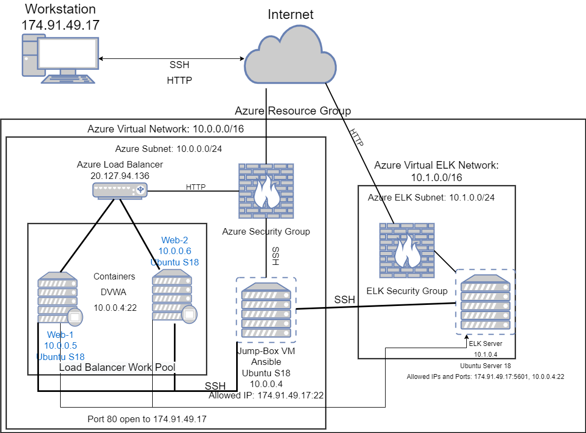
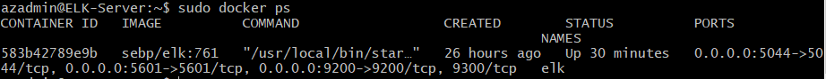

## Automated ELK Stack Deployment

The files in this repository were used to configure the network depicted below.

These files have been tested and used to generate a live ELK deployment on Azure. They can be used to either recreate the entire deployment pictured above. Alternatively, select playbook files may be used to install only certain pieces of it, such as Filebeat.

  - [my-playbook.yml](https://github.com/BilalN23/Projects/blob/main/Project-1/Ansible%20Playbooks/my-playbook.yml)
  - [filebeat-playbook.yml](https://github.com/BilalN23/Projects/blob/main/Project-1/Ansible%20Playbooks/filebeat-playbook.yml)
  - [metricbeat-playbook.yml](https://github.com/BilalN23/Projects/blob/main/Project-1/Ansible%20Playbooks/metricbeat-install.yml)
  - [elk-install.yml](https://github.com/BilalN23/Projects/blob/main/Project-1/Ansible%20Playbooks/elk-install.yml)

This document contains the following details:
- Description of the Topology
- Access Policies
- ELK Configuration
  - Beats in Use
  - Machines Being Monitored
- How to Use the Ansible Build

### Description of the Topology

The main purpose of this network is to expose a load-balanced and monitored instance of DVWA, the D*mn Vulnerable Web Application.

Load balancing ensures that the application will be highly available, in addition to restricting traffic to the network.

Integrating an ELK server allows users to easily monitor the vulnerable VMs for changes to the logs and system resources.

The configuration details of each machine may be found below.

| Name     | Function | IP Address | Operating System |
|----------|----------|------------|------------------|
| Jump Box | Gateway  | 10.0.0.1   | Linux            |
| Web-1    | Server   | 10.0.0.6   | Linux            |
| Web-2    | Server   | 10.0.0.7   | Linux            |
| ELK      | Server   | 10.1.0.4   | Linux            |

### Access Policies

The machines on the internal network are not exposed to the public Internet. 

Only the Jump Box machine can accept connections from the Internet. Access to this machine is only allowed from the following IP addresses:
- 174.91.49.17 (Workstation)

Machines within the network can only be accessed by the Ansible Container running on the Jump Box.
- 10.0.0.4 (Jump Box)

A summary of the access policies in place can be found in the table below.

| Name     | Publicly Accessible | Allowed IP Addresses |
|----------|---------------------|----------------------|
| Jump Box | Yes                 | 174.91.49.17         |
| Web-1    | No                  | 10.0.0.4             |
| Web-2    | No                  | 10.0.0.4             |
| ELK      | No                  | 10.0.0.4             |

The ELK server also has a network policy to allow the Workstation IP to access port 5601 to view the Kibana dashboard.

### Elk Configuration

Ansible was used to automate configuration of the ELK machine. No configuration was performed manually, which is advantageous because provisioners drastically reduce the potential for human error. Additionally, provisioners make it easy to configure multiple machines at once.

The playbook implements the following tasks:
- Install docker
- Install pip3 python module
- Increase VM memory
- Install ELK container
- Enable service to start on boot

The following screenshot displays the result of running `docker ps` after successfully configuring the ELK instance.

### Target Machines & Beats
This ELK server is configured to monitor the following machines:
- 10.0.0.6 (Web-1)
- 10.0.0.7 (Web-2)

We have installed the following Beats on these machines:
- Filebeat
- Metricbeat

These Beats allow us to collect the following information from each machine:
- Filebeat: system logs including sudo commands, ssh logins, new users and groups, etc
- Metricbeat: resource usage including CPU usage, memory usage, network usage, etc

### Using the Playbook
In order to use the playbook, you will need to have an Ansible control node already configured. Assuming you have such a control node provisioned: 

SSH into the control node and follow the steps below:
- Copy the elk-install.yml file to /etc/ansible
- Update the hosts file to include an [elk] group. For Filebeat/Metricbeat update the [webhost] group to include the desired VM IPs.
- Run the playbook, and navigate to http://[elk-VM-public-IP]:5601 to check that the installation worked as expected.
